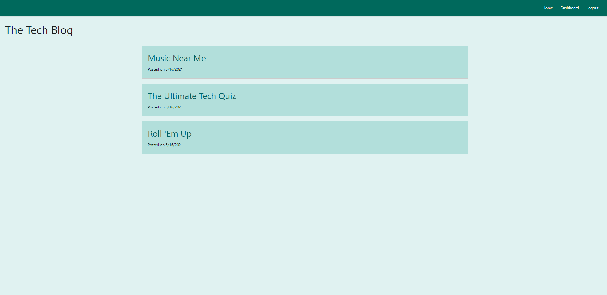

# TechBlog

## Table of Contents

1. [Description](#Description)
2. [Criteria](#Criteria)
3. [Installation](#Installation)
4. [Usage](#Usage)
5. [Contributing](#Contributing)
6. [Issues](#Issues)
7. [Credits](#Credits)
8. [License](#License)
9. [Questions](#Questions)

## Description

A website developed from scratch using Model-View-Controller format and MySql database to allow users to create, edit, delete, and view posts. Users can also comment on the posts. There was no requirement for comments being able to be edited and/or deleted so at this time, comments can only be posted.

This was an incredible amount of work to do as one person in a matter of one week, and I'm honestly amazed with myself that I got it completed at all. I did notice the post dates are a little different on the deployed website that my locally hosted version.

Used ClearDB addon to deploy to Heroku.

[Deployed website](https://morning-tech-blog.herokuapp.com/)

Example picture:

## Criteria

GIVEN a CMS-style blog site

WHEN I visit the site for the first time

THEN I am presented with the homepage, which includes existing blog posts if any have been posted; navigation links for the homepage and the dashboard; and the option to log in

    * 

WHEN I click on the homepage option

THEN I am taken to the homepage

    * 

WHEN I click on any other links in the navigation

THEN I am prompted to either sign up or sign in

    * 

WHEN I choose to sign up

THEN I am prompted to create a username and password

    * 

WHEN I click on the sign-up button

THEN my user credentials are saved and I am logged into the site

    * 

WHEN I revisit the site at a later time and choose to sign in

THEN I am prompted to enter my username and password

    * 

WHEN I am signed in to the site

THEN I see navigation links for the homepage, the dashboard, and the option to log out

    * 

WHEN I click on the homepage option in the navigation

THEN I am taken to the homepage and presented with existing blog posts that include the post title and the date created

    * 

WHEN I click on an existing blog post

THEN I am presented with the post title, contents, post creator’s username, and date created for that post and have the option to leave a comment

    * 

WHEN I enter a comment and click on the submit button while signed in

THEN the comment is saved and the post is updated to display the comment, the comment creator’s username, and the date created

    * 

WHEN I click on the dashboard option in the navigation

THEN I am taken to the dashboard and presented with any blog posts I have already created and the option to add a new blog post

    * 

WHEN I click on the button to add a new blog post

THEN I am prompted to enter both a title and contents for my blog post

    * 

WHEN I click on the button to create a new blog post

THEN the title and contents of my post are saved and I am taken back to an updated dashboard with my new blog post

    * 

WHEN I click on one of my existing posts in the dashboard

THEN I am able to delete or update my post and taken back to an updated dashboard

    * 

WHEN I click on the logout option in the navigation

THEN I am signed out of the site

    * 

WHEN I am idle on the page for more than a set time

THEN I am automatically signed out of the site 

    * 

## Installation

Files must be downloaded from Github. Then, run npm install to get the necessary node modules. Edit or duplicate the .env.EXAMPLE file to be just a .env file and fill in your MySql username and password. Open the schema.sql in MySql and run the file. Back in the code application, run node seeds to fill information into the database. Last, run npm start.

A ready version is also available at the [deployed website](https://morning-tech-blog.herokuapp.com/)

## Usage

This is an application where users can sign up and login to write, edit, or delete their posts and view other users' posts. They can also comment on the posts. The posts, comments, and user info are stored in a backend database. User passwords are hashed so they are securely stored.

## Contributing

For contributions, please create a fork to work on then, when done, create a Pull Request.

## Issues

Submit an Issue through Github for any bugs or problems.

## Credits

Assignment was developed as part of the SMU Coding Bootcamp.

## License

Copyright Ashley Wright 2021

This is covered under the <a href='https://opensource.org/licenses/ISC'>ISC</a> license.

## Questions

Feel free to contact through the following with any questions:

Email: ashleyaggie@aol.com

Github: <a href='https://github.com/ashleyaggie'>ashleyaggie</a>